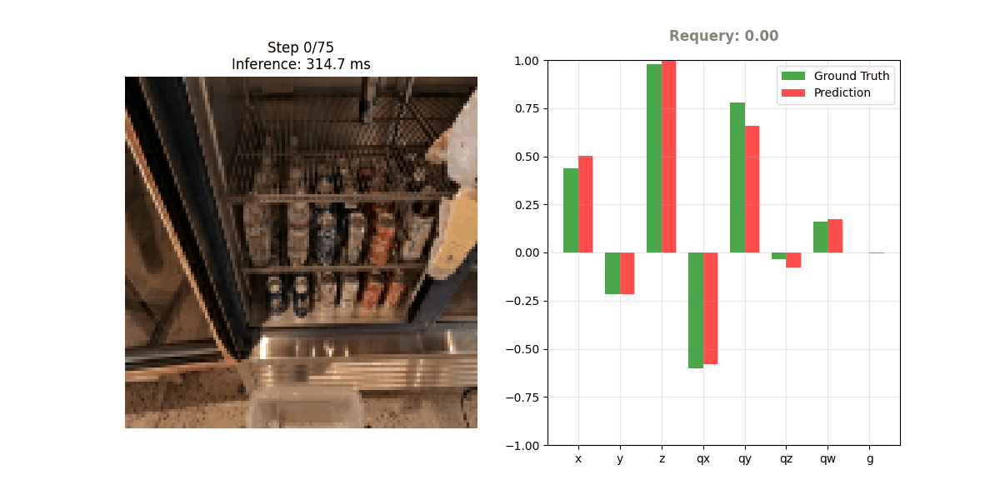
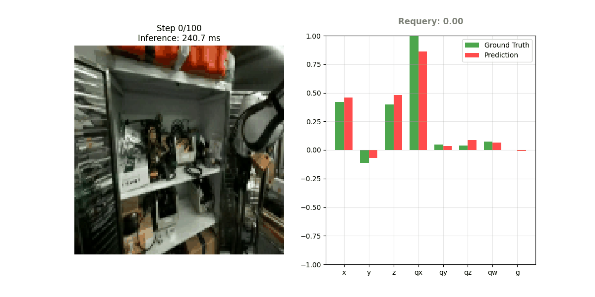

# Axis: SE(3) Robot Control Policy

Axis is a PyTorch transformer-based robot learning framework for end-effector control using SE(3) Lie group representations. Trained on DROID and Fractal datasets via imitation learning.

## Latest Results



## Key Features

| Feature | Description |
|---------|-------------|
| **SE(3) Twists** | Actions represented as 7D Lie algebra twists (`[ω, v, gripper]`) for geometrically consistent control |
| **SE(3) State** | Proprioception as 13D SE(3) pose (`[R_flat(9), pos(3), gripper(1)]`) using PyPose |
| **Action Chunking** | Predicts W future actions in parallel (no autoregressive rollout) |
| **Temporal Ensembling** | Smooth action output via overlapping chunk averaging |
| **Endpoint Chordal Loss** | Task-oriented SE(3) chordal loss (trig-free Frobenius norm) |
| **Self-Supervised Confidence** | Learns to predict own accuracy (requery signal) |
| **Local + Streaming Data** | Train from GCS or preprocessed HDF5 files |

## Architecture

```
Inputs:
  - Images: (B, W, 3, 128, 128)     → ResNet-18 + TokenLearner → 256D
  - Proprio: (B, W, 13)             → MLP → 128D  
  - Goal: (B, 38)                   → MLP → 128D

Token: [Proprio | Vision | Goal] = 512D per timestep

Backbone: Transformer (4 layers, 8 heads, RoPE positional encoding)

Output: (B, W, 7) twist actions + (B, 1) confidence
```

## Installation

```bash
git clone https://github.com/Thoooomas14/Axis.git
cd Axis
conda env create -f environment.yml
conda activate axis_env
```

See [Installation Guide](docs/installation.md) for details.

## Quick Start

### Training

**Option A: Stream from GCS**
```bash
gcloud auth application-default login  # Required once

python imitation/train.py \
    --dataset fractal20220817_data \
    --batch_size 32 \
    --steps 10000
```

**Option B: Local preprocessed** (recommended for DROID)
```bash
# 1. Preprocess once
python -m imitation.data.preprocessor --output E:/data/droid.h5 --dataset droid

# 2. Train
python imitation/train.py --local_data_path E:/data/droid.h5 --batch_size 32
```

### Evaluation

```bash
python scripts/evaluate_sequence.py --checkpoint_dir checkpoints
```

### Key Training Args

| Arg | Description | Default |
|-----|-------------|---------|
| `--local_data_path` | Preprocessed HDF5 (overrides streaming) | None |
| `--window_size` | Temporal context / action chunk size | 10 |
| `--loss_horizon` | Steps to rollout before loss (1=immediate) | 1 |
| `--omega_rot` | Rotation loss weight | 1.0 |
| `--omega_trans` | Translation loss weight | 1.0 |

Run `python imitation/train.py --help` for all options.

## Documentation

| Doc | Description |
|-----|-------------|
| [Model Design](docs/model_design.md) | Architecture, 13D poses, 38D goals |
| [Training Process](docs/training_process.md) | Loss functions, checkpointing, OOM recovery |
| [Data Pipeline](docs/data_pipeline.md) | RTXStreamLoader, LocalDataLoader, preprocessing |
| [Isaac Integration](docs/isaac_integration.md) | Simulation deployment |

## Project Structure

```
src/
  models/         # AxisModel, encoders, decoders, transformer
  inference.py    # Production wrapper with ensembling
  utils/          # SE(3) utilities, rotation conversions

imitation/
  train.py        # Training script
  data/           # Data loaders, preprocessor, goal oracle

scripts/          # Evaluation, verification utilities
docs/             # Documentation
```

## Citation

If you use Axis in your research:
```bibtex
@software{axis2025,
  title={Axis: SE(3) Robot Control Policy},
  author={Thomas},
  year={2025},
  url={https://github.com/Thoooomas14/Axis}
}
```
