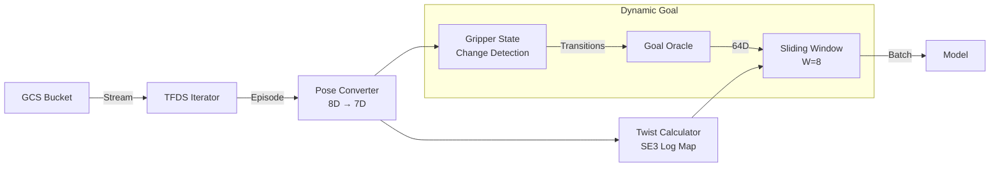

# Data Pipeline (V2)

Axis V2 supports two data loading modes:
1. **Streaming**: Direct from GCS via RTXStreamLoader (default)
2. **Local**: From preprocessed HDF5 via LocalDataLoader (faster, lower RAM)

## Components

### 1. RTXStreamLoader (`imitation/data/rtx_stream_loader.py`)

The core data loader wrapping `tensorflow_datasets` (TFDS) for streaming.

#### Key Features

- **Streaming**: Uses `tfds.load(..., streaming=True)` to avoid downloading entire datasets
- **Continuous Episodes**: Processes full episodes without subtask splitting
- **Dynamic Goals**: Goal vector updates automatically when gripper state changes
- **7D SE(3) Conversion**: Converts raw 8D poses (pos + quaternion + gripper) to 7D minimal format
- **Twist Computation**: Calculates ground truth 7D twist actions using SE(3) log map
- **Platform-Aware**: Windows-compatible memory management

#### Episode Processing

Episodes are processed as continuous sequences. The goal vector updates dynamically when the gripper state changes (subtask transitions):

```python
# Gripper change detection
is_closed = grippers > 0.5
gripper_changes = np.where(is_closed[1:] != is_closed[:-1])[0] + 1

# Goal updates at each transition
# Pick: open → closed
# Place: closed → open
# Move: no change
```

#### Twist Computation

Ground truth twists computed via SE(3) log map:
```python
# T_curr, T_next are 4x4 SE(3) matrices
twist = se3_log(T_curr.inverse() @ T_next)
# twist = [ω_x, ω_y, ω_z, v_x, v_y, v_z]  (6D)

# With gripper delta (7D)
twist_7d = [ω, v, gripper_next - gripper_curr]
```

#### Subtask Types

| Type | Trigger | Description |
|------|---------|-------------|
| **Pick** | Gripper Open → Closed | Approach and grasp object |
| **Place** | Gripper Closed → Open | Move to location and release |
| **Move** | No significant change | Navigate end-effector |

### 2. Goal Oracle (`imitation/data/goal_oracle.py`)

Generates deterministic 64D semantic goal embeddings during training.

#### Goal Vector Layout (64D)

| Indices | Dims | Component |
|---------|------|-----------|
| 0-2 | 3 | Task type one-hot `[Move, Pick, Place]` |
| 3-9 | 7 | Start pose (7D SE(3) minimal) |
| 10-16 | 7 | End pose (7D SE(3) minimal) |
| 17-39 | 23 | Object properties & spatial relations |
| 40-55 | 16 | Reserved (zeros) |
| 56-63 | 8 | Regularization noise (σ configurable) |

#### Configurable Noise Scale

```python
oracle = GoalOracle(output_dim=64, noise_scale=0.1)
```

### 3. Output Format

Each batch contains (where H = `loss_horizon`):

| Key | Shape | Description |
|-----|-------|--------------|
| `images` | `(B, W, 3, 128, 128)` | RGB images (observation window) |
| `proprio` | `(B, W, 7)` | 7D SE(3) poses (observation window) |
| `goal` | `(B, 64)` | Dynamic goal embedding |
| `actions` | `(B, H, 7)` | 7D twist targets for future H steps |
| `target_poses` | `(B, H, 7)` | Direct future poses for endpoint loss |

> **Windowing**: Episodes are windowed such that there are always H valid future poses after each window. Windows near episode end are excluded.

> **Note**: `requery` is not in data - trained as model confidence from action loss.

## Data Flow



## Memory Management

The loader includes automatic memory management:

```python
# After each episode
gc.collect()

# Linux only: release memory to OS
if platform.system() == 'Linux':
    libc.malloc_trim(0)
```

## Usage

```python
from imitation.data.rtx_stream_loader import RTXStreamLoader

loader = RTXStreamLoader(
    dataset_name='fractal20220817_data',
    split='train',
    window_size=8,
    shuffle_buffer_size=10  # Reduce if OOM
)

for batch in loader:
    images = batch['images']      # (B, 8, 3, 128, 128)
    proprio = batch['proprio']    # (B, 8, 7)
    goal = batch['goal']          # (B, 64)
    actions = batch['actions']    # (B, 8, 7)
```

---

## Local Data Loading (Recommended for Large Datasets)

For large datasets like DROID, preprocessing once and loading locally is recommended.

### 1. Preprocessor (`imitation/data/preprocessor.py`)

One-time script to extract and save minimal episode data:

```bash
# Preprocess DROID
python -m imitation.data.preprocessor --output E:/data/droid.h5 --dataset droid

# Preprocess Fractal
python -m imitation.data.preprocessor --output E:/data/fractal.h5 \
    --dataset fractal20220817_data --data_dir gs://gresearch/robotics

# Test with subset
python -m imitation.data.preprocessor --output ./test.h5 --max_episodes 10
```

**Stored per episode:**
| Field | Shape | Dtype |
|-------|-------|-------|
| images | (T, 3, 128, 128) | uint8 |
| proprio | (T, 7) | float32 |

### 2. LocalDataLoader (`imitation/data/local_loader.py`)

Loads preprocessed data and computes windowing, goals, twists at load time:

```python
from imitation.data.local_loader import LocalDataLoader

loader = LocalDataLoader(
    data_path='E:/data/droid.h5',
    window_size=8,
    loss_horizon=1,
)

for batch in loader:
    # Same format as RTXStreamLoader
    images = batch['images']      # (B, W, 3, 128, 128)
    proprio = batch['proprio']    # (B, W, 7)
    goal = batch['goal']          # (B, 64)
```

### 3. Train from Local Data

```bash
python imitation/train.py --local_data_path E:/data/droid.h5 --steps 10000
```

> **Note**: When `--local_data_path` is set, streaming args (`--dataset`, `--data_dir`, etc.) are ignored.
