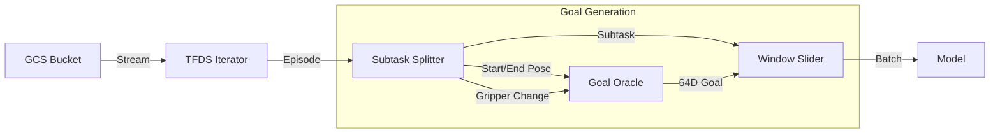

# Data Pipeline

Axis uses a custom data pipeline designed for streaming large robotics datasets from Google Cloud Storage (GCS) and processing them on-the-fly.

## Components

### 1. RTXStreamLoader (`training/data/rtx_stream_loader.py`)

This is the core data loader. It wraps `tensorflow_datasets` (TFDS) to stream data.

#### Key Features:
-   **Streaming**: Uses `tfds.load(..., streaming=True)` to avoid downloading the entire dataset.
-   **Subtask Splitting**: Robotics episodes are often long sequences of multiple actions (e.g., pick object A, place it, pick object B). The loader splits these into semantic **subtasks** based on gripper state changes.
    -   **Pick**: Gripper Open $\to$ Closed.
    -   **Place**: Gripper Closed $\to$ Open.
    -   **Move**: No significant gripper change.
-   **Windowing**: It slides a window of size $W=8$ over each subtask.
-   **Requery Logic**: The `requery` label is set to `1.0` *only* at the end of a subtask, signaling the model that the current semantic action is complete.

### 2. Goal Oracle (`training/data/goal_oracle.py`)

Axis uses a deterministic "Oracle" to generate semantic goal embeddings during training. This replaces the need for a live large language model.

#### Goal Encoding (64D):
The goal is a 64-dimensional vector constructed from:
1.  **Task Type** (3D One-hot):
    -   `[1, 0, 0]` = Move
    -   `[0, 1, 0]` = Pick
    -   `[0, 0, 1]` = Place
2.  **Start Pose** (8D): The EE pose at the start of the subtask (Pos + Quat + Gripper).
3.  **End Pose / POI** (8D): The EE pose at the end of the subtask (the target).

These inputs (19D total: 3 task type + 8 start + 8 end) are projected into 64D using a fixed, random projection matrix. This ensures the embedding is:
-   **Deterministic**: Same inputs always yield same embedding.
-   **Semantic**: Contains all necessary info (what to do, where to start, where to go).
-   **Dense**: Distributed across the 64 dimensions.

## Data Flow Diagram

