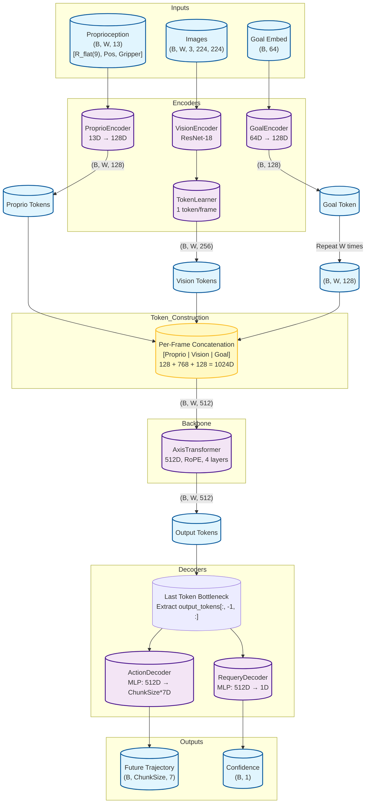
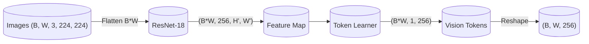

# Axis V2 Model Architecture

This document visualizes the data flow and structure of the Axis V2 model.

## High-Level Data Flow



## Key V2 Architecture Changes

| Component | V1 | V2 (Pure Chunking) |
|-----------|----|----|
| Proprioception | 7D (rotvec + pos + grip) | **13D** (R_flat + pos + grip) |
| Action Output | 10D delta pose | **7D twist** (ω, v, grip) |
| Token Structure | Interleaved P, V tokens | **Concatenated** per frame |
| Output Shape | (B, W, 7) sequential | **(B, ChunkSize, 7)** from last token |
| Requery | Binary logit | **Confidence** [0, 1] |

## Token Concatenation

Each timestep produces a single 512D token:

```
┌──────────────────────────────────────────────┐
│  Proprio (128D)  │  Vision (768D)  │  Goal (128D)  │
└──────────────────────────────────────────────┘
                    512D total
```

The transformer sees a sequence of W=8 such tokens.

## Vision Pipeline



## Action Chunking

V2 predicts a **full window of actions** in one forward pass:

```python
pred_action, confidence = model(images, proprio, goal)
# pred_action: (B, ChunkSize, 7) - Chunk of future twist actions
# confidence: (B, 1) - model confidence for this trajectory

# At inference, use temporal smoothing
ensembler = ActionChunkEnsembler(chunk_size=ChunkSize)
action = ensembler.update(pred_action)  # Smoothed action
```

## Decoder Details

### Action Decoder

Predicts the entire trajectory from the **last transformer token**:
```python
# Based on output_tokens[:, -1, :] (512D)
trajectory = MLP(last_token)  # 512D → 10 * 7D
pred_action = trajectory.reshape(B, 10, 7)
```

Output is clamped by `SafeActionDecoder`:
- Rotation: ±0.2 rad/step
- Translation: ±0.05 m/step

### Requery Decoder (Confidence)

Simplified to a standard MLP acting on the last token:
```python
# Based on output_tokens[:, -1, :] (512D)
confidence = sigmoid(MLP(last_token))  # 512D → 1D
```

During training, target = `exp(-action_loss / temperature)`.

## Dimension Summary

| Tensor | Shape | Description |
|--------|-------|-------------|
| Input Images | `(B, W, 3, 224, 224)` | RGB images |
| Input Proprio | `(B, W, 13)` | 13D SE(3) poses |
| Input Goal | `(B, 64)` | Semantic goal |
| Vision Tokens | `(B, W, 256)` | 1 token per frame |
| Proprio Tokens | `(B, W, 128)` | Encoded proprio |
| Goal Tokens | `(B, W, 128)` | Repeated goal |
| Transformer Input | `(B, W, 512)` | Concatenated tokens |
| Action Output | `(B, ChunkSize, 7)` | 7D twists |
| Confidence Output | `(B, 1)` | Single scalar |