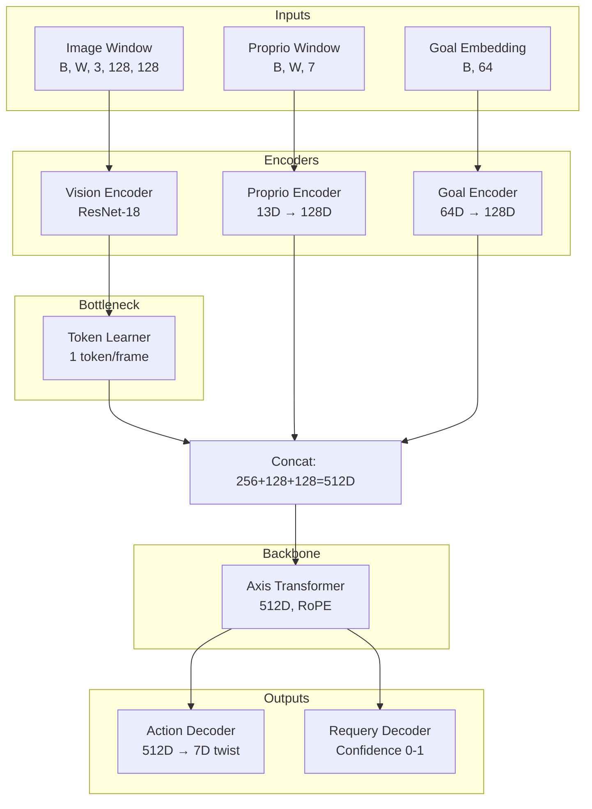

# Axis Model Design (V2)

The Axis model is a general-purpose, multi-robot control policy that learns from diverse datasets. It treats robot control as a sequence modeling problem, predicting **SE(3) twist actions** based on a history of observations and a semantic goal.

## Key V2 Changes

- **13D Full SE(3) Poses**: Uses flattened rotation matrix + translation + gripper
- **7D Twist Actions**: Predicts Lie algebra twists (ω, v, gripper) via PyPose
- **Chordal Loss**: Trig-free SE(3) loss using Frobenius norm
- **Action Chunking**: Outputs `(B, W, 7)` - a sequence of W future actions per forward pass
- **Confidence Requery**: Self-supervised confidence prediction based on action loss
- **RoPE**: Rotary Position Embeddings for better sequence modeling

## Architecture Overview



## Dimensions

| Component | Dimension | Description |
|-----------|-----------|-------------|
| Proprioception | 13D | `[R_flat(9), p_x, p_y, p_z, gripper]` - Flattened rotation matrix + translation + gripper |
| Action (Twist) | 7D | `[ω_x, ω_y, ω_z, v_x, v_y, v_z, gripper_delta]` - Angular velocity + linear velocity + gripper |
| Goal | 64D | Structured semantic goal vector (includes 13D start/end poses) |
| Vision tokens | 256D | Per-frame visual features (1 token/frame) |
| Proprio tokens | 128D | Encoded proprioceptive state |
| Goal tokens | 128D | Encoded goal embedding |
| Transformer | 512D | Concatenated token embedding |

## Component Details

### 1. Encoders

#### Proprio Encoder
- **Input**: 13D full SE(3) pose `[R_flat(9), translation(3), gripper(1)]`
- **Running Normalization**: Uses EMA to normalize inputs during training
- **Output**: 128D latent vector

#### Vision Encoder & Token Learner
- **Vision Encoder**: ResNet-18 backbone with FiLM conditioning on goal
- **Token Learner**: Compresses spatial features to 1 token per frame (256D)

#### Goal Encoder
- **Input**: 64D structured goal vector
- **Output**: 128D goal embedding

### 2. Axis Transformer

- **Type**: Transformer Encoder with RoPE (Rotary Position Embeddings)
- **Embedding**: 512D (256 vision + 128 proprio + 128 goal concatenated per timestep)
- **Token Order**: `[Proprio(128) | Vision(256) | Goal(128)]` per timestep
- **Layers**: 4 layers, 8 heads

The transformer processes a sliding window of W=8 timesteps, with each timestep's tokens concatenated into a single 512D vector.

### 3. Decoders

#### Action Decoder
- **Input**: Transformer output tokens `(B, W, 512)`
- **Output**: 7D twist per timestep `(B, W, 7)`
- **SafeActionDecoder**: Wraps output with safety clamps (rotation and translation limits)

#### Requery Decoder (Confidence)
- **Function**: Predicts model confidence as a self-supervised signal
- **Training**: Target = `exp(-action_loss / temperature)` - high when predictions are accurate
- **Output**: Single scalar `(B, 1)` via attention pooling across all timesteps
- **Inference**: When confidence < threshold, request new goal from high-level planner

## SE(3) Representation

Axis V2 uses **SE(3) Lie group** representation with **PyPose** library:

### Poses (13D Full Matrix)
```
[R_00, R_10, R_20, R_01, R_11, R_21, R_02, R_12, R_22, p_x, p_y, p_z, gripper]
 └────────────── Flattened 3x3 Rotation Matrix ──────────────┘  └─ Trans ─┘   └─ Grip
```

Using the full rotation matrix avoids trigonometric conversions in the loss function.

### Actions (7D Twist)
```
[ω_x, ω_y, ω_z, v_x, v_y, v_z, gripper_delta]
 └─ Angular Velocity ─┘  └─ Linear Velocity ─┘   └─ Gripper Δ
```

Twist actions are integrated using PyPose's SE(3) exponential map:
```python
import pypose as pp
T_new = (pp.mat2SE3(T_current) @ pp.Exp(pp.se3(twist))).matrix()
```

## Data Flow

1. **Input**: Window of W=8 images, 13D proprio states, and 64D goal
2. **Encoding**: Each modality encoded to its latent dimension
3. **Concatenation**: Per-timestep tokens concatenated to 512D
4. **Transformer**: RoPE-based attention across temporal sequence
5. **Decoding**:
   - Action: 7D twist for each timestep in window `(B, W, 7)`
   - Requery: Single confidence value `(B, 1)`
