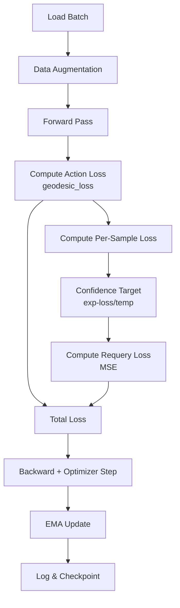

# Training Process (V2)

This document outlines how to train the Axis V2 model.

## Training Script: `imitation/train.py`

The core training logic handles:
1. Model initialization with 13D SE(3) poses and 7D twist actions
2. Dataset loading: streaming from GCS **or** local preprocessed HDF5
3. Action chunking - model predicts W future actions simultaneously
4. Self-supervised confidence training (requery signal)
5. Dynamic OOM recovery

## Configuration

Key parameters in the config dictionary:

| Parameter | Description | Default |
|:---|:---|:---|
| `goal_dim` | Dimension of input goal embeddings | 64 |
| `embed_dim` | Token embedding dimension (vision+proprio+goal) | 512 |
| `num_heads` | Number of attention heads | 8 |
| `num_layers` | Number of transformer layers | 4 |
| `proprio_dim` | Dimension of SE(3) full matrix pose | **13** |
| `action_dim` | Dimension of twist output | **7** |
| `window_size` | Sliding window of historical observations | 8 |
| `chunk_size` | Model parameter: number of future actions to predict | **10** |
| `action_dim` | Dimension of twist output | **7** |

## Loss Functions

### Chordal Loss (Actions) - Trig-Free!

Axis V2 uses a **chordal loss** for SE(3) that directly compares rotation matrices using Frobenius norm:

```python
import pypose as pp

def endpoint_chordal_loss(pred_twists, start_poses, target_poses, horizon):
    # Rollout predicted twists from 13D start pose
    T_pred = build_se3_from_13d(start_poses)  # (B, 4, 4)
    for t in range(horizon):
        T_delta = pp.Exp(pp.se3(pred_twists[:, t, :6]))
        T_pred = pp.mat2SE3(T_pred) @ T_delta
        T_pred = T_pred.matrix()
    
    # Chordal loss: ||R_pred - R_target||^2_F + ||p_pred - p_target||^2
    rot_loss = frobenius_norm(R_pred - R_target)
    trans_loss = l2_norm(p_pred - p_target)
    return omega_rot * rot_loss + omega_trans * trans_loss + grip_loss
```

**Why Chordal Loss?**
- No trigonometric functions (no `sin`, `cos`, `acos`, `atan2`)
- Numerically stable gradients
- Direct matrix comparison

### Endpoint Loss (Task-Oriented)

For task-oriented training, **endpoint loss** focuses on where the robot ends up rather than following the exact trajectory:

```python
# Apply predicted twists to reach endpoint using PyPose
for t in range(loss_horizon):
    T_curr = (pp.mat2SE3(T_curr) @ pp.Exp(pp.se3(pred_twist[t]))).matrix()

# Compare to target endpoint (chordal distance)
loss = chordal_distance(final_pose, target_endpoint)
```

This is controlled by `--loss_horizon`:
- `--loss_horizon 1`: Immediate next-step loss (fine-grained)
- `--loss_horizon 8`: Full chunk endpoint (task completion)

### Confidence Loss (Requery)

The requery signal is trained as a **self-supervised confidence measure** using MSELoss:

```python
# Per-sample loss → Confidence target
per_sample_loss = mean((pred - target)**2, dim=[-1, -2])  # (B,)
confidence_target = exp(-per_sample_loss / temperature)    # (B, 1)

# High accuracy predictions → High confidence target
# Low accuracy predictions → Low confidence target
requery_loss = MSELoss(requery_pred, confidence_target)
```

This teaches the model to predict its own accuracy - when to ask for help vs. proceed confidently.

## Data Loading

### Option 1: Streaming (default)

**RTXStreamLoader** streams data from Google Cloud Storage in RLDS format:
- **Pose Format**: Converts raw 8D poses (pos + quaternion + gripper) to 13D full SE(3)
- **Twist Computation**: Calculates ground truth twists using PyPose `Log(T_curr⁻¹ · T_next)`
- **Continuous Episodes**: Processes full episodes without subtask splitting
- **Dynamic Goals**: Goal vector updates when gripper state changes

### Option 2: Local Preprocessed (recommended for large datasets)

**LocalDataLoader** loads from preprocessed HDF5 files:

```bash
# 1. Preprocess once (supports external drives)
python -m imitation.data.preprocessor --output E:/data/droid.h5 --dataset droid

# 2. Train from local
python imitation/train.py --local_data_path E:/data/droid.h5
```

> When `--local_data_path` is set, streaming args are ignored (with warning).

### GCS Authentication (streaming only)

```bash
# Local machine with browser
gcloud auth application-default login

# Remote/headless machine
gcloud auth application-default login --no-launch-browser
```

## Running Training

```bash
python imitation/train.py \
    --dataset fractal20220817_data \
    --batch_size 32 \
    --lr 1e-4 \
    --steps 10000 \
    --window_size 8 \
    --loss_horizon 1 \
    --omega_rot 1.0 \
    --omega_trans 1.0 \
    --confidence_temperature 1.0 \
    --verbose 1
```

## CLI Arguments

### Data Source
| Argument | Description | Default |
|:---|:---|:---|
| `--dataset` | [Streaming] TFDS dataset name | `fractal20220817_data` |
| `--data_dir` | [Streaming] Data directory (GCS) | `gs://gresearch/robotics` |
| `--image_key` | [Streaming] Image key to use | auto |
| `--local_data_path` | Path to preprocessed HDF5 (overrides streaming) | None |
| `--no_subprocess` | [Streaming] Disable subprocess isolation | False |
| `--shuffle_buffer_size` | [Streaming] TFDS shuffle buffer | 10 |

### Core Training
| Argument | Description | Default |
|:---|:---|:---|
| `--steps` | Training steps (if epochs=0) | 10000 |
| `--epochs` | Training epochs (overrides steps if >0) | 0 |
| `--batch_size` | Batch size | 1 |
| `--lr` | Learning rate | 1e-4 |
| `--warmup_steps` | LR warmup steps | 1000 |
| `--window_size` | Size of the observation history window | 10 |
| `--loss_horizon` | Future steps for endpoint loss (**must be <= chunk_size**) | 1 |

### Checkpointing & Validation
| Argument | Description | Default |
|:---|:---|:---|
| `--checkpoint_dir` | Directory for checkpoints | `checkpoints` |
| `--save_interval` | Steps between checkpoints | 1000 |
| `--resume` | Resume from latest checkpoint | False |
| `--val_interval` | Steps between validation | 5000 |
| `--val_batch_size` | Validation batch size | 32 |
| `--val_batches` | Number of validation batches | 50 |
| `--train_split_pct` | Train/val split percentage | 0.95 |

### Memory & Performance
| Argument | Description | Default |
|:---|:---|:---|
| `--num_workers` | Dataloader workers | 0 |
| `--shuffle_buffer_size` | TFDS shuffle buffer (reduce if OOM) | 10 |
| `--time_limit_min` | Stop after N minutes (0=disabled) | 0 |

### Visualization & Logging
| Argument | Description | Default |
|:---|:---|:---|
| `--viz` | Enable visualization | False |
| `--viz_interval` | Steps between visualizations | 1000 |
| `--verbose` | Logging verbosity: 0=WARN, 1=INFO, 2=DEBUG | 1 |

## Training Flow



## Memory Management

The training script includes automatic OOM recovery:

### CUDA OOM
- Automatically halves `batch_size`
- Rebuilds dataloader with new parameters
- Continues training

### RAM OOM
- First reduces `shuffle_buffer_size`
- Then reduces `num_workers`
- Graceful exit if at minimum

### Platform-Specific
- **Linux**: Calls `malloc_trim()` periodically to release memory
- **Windows**: Falls back to `gc.collect()`

## Checkpointing

- **During Training**: Only `checkpoint_latest.pt` is kept
- **On Completion**: Archived as `run_<timestamp>_<dataset>_steps<N>.pt`
- **Logs**: `training_log.csv` and `training_plot.png`

## Action Chunking

Unlike autoregressive training, Axis V2 uses **action chunking** from the current state:

```python
# Model extracts LAST token and predicts chunk
pred_action, requery_pred = model(images, proprio, goals)
# pred_action: (B, ChunkSize, 7) - Future trajectory
# requery_pred: (B, 1) - Confidence score for this chunk

# Loss computed over the trajectory up to loss_horizon
action_loss = chordal_loss(pred_action, target_actions, horizon=loss_horizon)
```

Benefits:
- **Efficiency**: Single forward pass predicts long-horizon trajectory.
- **Independence**: Decouples observation window (history) from prediction chunk (future).
- **Consistency**: High-quality trajectories without autoregressive drift.
